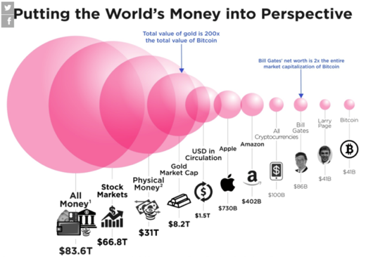
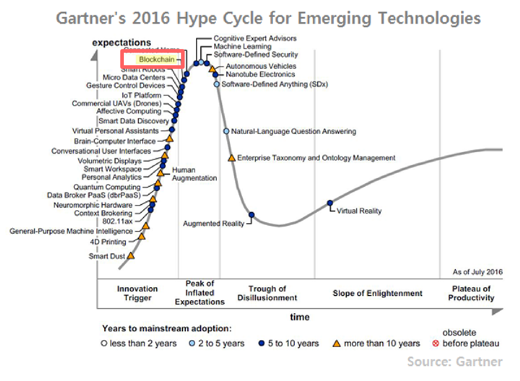
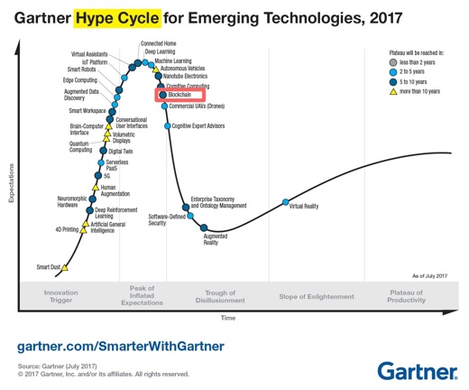
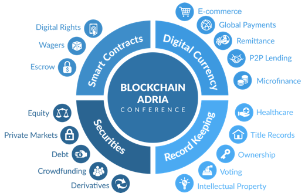
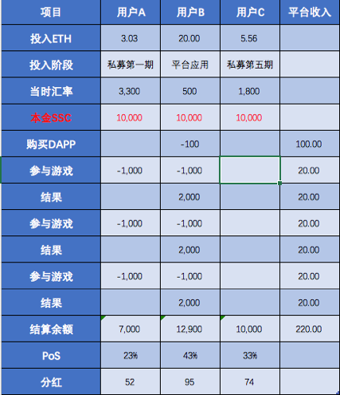
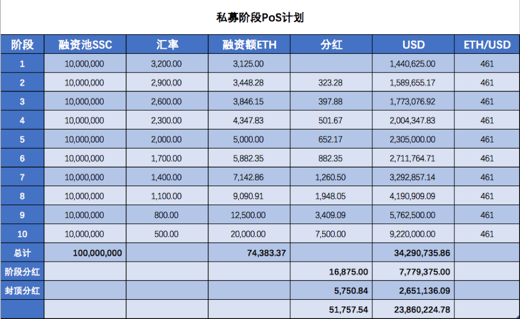

<h1>SecondSpace 第二空间项目白皮书</h1>

 https://secondspace.io 

## 1 背景

### 1.1 项目起源

&#8195;&#8195;自从以太坊重新定义了智能合约以后，围绕着以太坊的生态环境逐渐建立起来。以太坊用 ERC20 标准让代币的发行和流通变得异常简单，让市场中充斥着各种代币，但用户手握大量的各种加密货币只能有两种应用通路，一是在交易所买卖，二是在 DApp 中使用。这也是现在每隔几个月有一款爆红的 DApp， 以及交易所持续暴利现象后的本质原因。因为用户手里的这些热钱无处可去，每当看到一个出口时都会像洪水一下奔涌过去。

&#8195;&#8195;在金融历史中，每种货币的发行都有严格的本位机制支撑，每一分货币的发行都是建立在生产创造之上的。假设我们回到远古时代第一枚货币的创造上来看，是原始人先生产了足够的粮食，满足了自己生存需要后拿去和其他人换取一些生活必需品，这时产生了第一枚货币。所以货币的发行是建立在生产的基础上的，虽然随着历史发展金融行业进步起来后，有了杠杆机制、准备金制度，有了银本位、金本位、信用本位制等更灵活的货币发行机制，允许我们适当的挣脱生产的锁链更灵活的发行货币、增加更多的市场流动性，但不管怎么发展货币背后都会有一个机制保障货币的价值，控制发行的增速在可控的范围内。历史中透支信用、打破货币发行机制的案例也有很多，最终大都以破灭而告终。

&#8195;&#8195;而区块链发行的代币大都是凭空发行的货币，虽然用PoW机制锚定了矿机的算力，但这样的算力锚定是否能代替本位制？区块链根据时间推进的自动增发的机制，不考虑市场需求和流动性的压力是否合理？所以要想长远稳定的发展加密货币必须找到加密货币更有力支撑机制，以及可控合理的货币流通机制。

&#8195;&#8195;SecondSpace 第二空间平台是为了解决各种加密货币流通和支撑本位问题而创建的项目。SecondSpace 是一个开放的 DApp 开发、应用平台，SecondSpace 提供用户普遍认可的支持各种加密货币的 DApp 产品，允许用户自己部署并推广使用。 

&#8195;&#8195;SecondSpace 平台提供所有技术架构、解决方案、基础设施、硬件设备、网络带宽。任何人都可以在 SecondSpace 平台上部署并拥有自己的 DApp产品。

> 以太坊用 ERC20 标准让每个人都可以拥有自己的代币，SecondSpace 通过 BlockChain Package 技术让每个人都可以拥有自己的 DApp。 -- Stephen

### 1.2 市场分析

<i>2017年加密货币和美元市场规模的对比（引用1）</i>

&#8195;&#8195;到目前为止全球整个加密数字货币的总市值约为 2742 亿美元（引用2），一款叫做Crypto Kitties(迷恋猫)的DApp上线半年交易额突破 100 万个 ETH。2018年中一款叫Fomo3D 的DApp游戏上线一个月总投注 96020 个 ETH。这说明什么？这说明全球已经投入区块链里太多的钱，但让用户可配置的资产却很少，用户手里攥着大量的热钱无处可去，所以每当看到一个可能的出口，都会像洪水一下奔涌过去。所以市场需要更多的 DApp。

<i>2016年技术成熟度曲线图(Hype Cycle)</i>

<i>2017年技术成熟度曲线图(Hype Cycle)</i>

&#8195;&#8195;Gartner 的 Hype Cycle 技术成熟度曲线图是用来发现和预测新兴技术的工具。可以让我们清晰的看到行业的未来，研判行业的趋势。我们来对比 2016 年至 2017 年的 Hype Cycle 图表，我们发现区块链技术正在步入成熟期，这说明区块链的基础设施基本建设完毕。它需要整理行囊再次出发了，需要找到新的技术突破点了。

&#8195;&#8195;Hype Cycle 将新兴技术产业分为五个阶段，Technology Trigger and Peak of Inflated Expectations（上升期和快速发展期）、Trough of Disillusionment（下降期），Slope of Enlightenment（爬坡期），Plateau of Productivity（稳定应用期）。现在的区块链行业已经完成了上升期和快速发展期，所以区块链的基础设施基本已经完善了，后面将会进入爬坡期，应用层的技术创新开始发力了。

&#8195;&#8195;交易市场只是区块链行业中的基础设施未来会逐渐下沉，随着基础设施的技术门槛降低竞争加剧，经过几次洗牌后暴利空间将会回落到正常水平，从而让交易所不在是市场的主角。交易所应用场景单一和经济模型简单，无法满足未来高流通性的需求。就像电信移动一样，他们从来都不是互联网的核心产品。

&#8195;&#8195;未来的是DApp的市场，而现在 DApp 开发商和参与者还主要是币圈和链圈的人，这个市场需要更多的人参与进来，需要一个人人能参与、人人能发行、开发的 DApp开放平台。

 
> 链上的问题，只能用在链上解决。 -- Stephen

## 2 平台说明

### 2.1 目标和使命

-	激活更多的加密数字货币，让每个加密货币找到自己的价值
-	帮助更多想参与到区块链盛宴中的人提供便利的通道
-	让持币的用户拥有更多的配置资产的方式和机会

&#8195;&#8195;我们的目标是建立一个支持全币种的DApp的开放平台，也就是说不管是比特币、以太坊这种主流币，还是其它空气币都可以在SecondSpace平台上使用，将极大的激活加密货币市场。

&#8195;&#8195;我们的开发公平机制会让参与到平台中的每个都是自己价值的体现，我们努力建立一个多赢的平台。

&#8195;&#8195;拥有各种加密货币的用户可以通过参与DApp游戏、应用，有机会让自己的加密货币升值，创造更多的机会。

### 2.2 什么是区块链

&#8195;&#8195;区块链是一种以密码学技术为基础，以去中心化的方式，对大量数据进行组织和维护的数据结构。区块链上的数据全部都附有相关人的数字签名，不可伪造。 此外，区块链还具有完全公开、高可靠性、即时交割、去信任等诸多优点，可以 实现全球数据共享和溯源，使得构建更高规模、更高质量、可控制权限、可审计 的全球去中心化人工智能数据训练平台成为可能。

<i>区块链的生态</i>

### 2.3 为何要用区块链技术

&#8195;&#8195;竞猜游戏的历史可能和货币的历史一样的长，所以竞猜是人类核心欲望的一种体现。但在过去几千年里围绕着竞猜有两个无解的问题，这两个问题一次次伤害这参与竞猜游戏的人。

&#8195;&#8195;第一个是游戏的公平性，无法保证所有人在一个公平公正的环境里参与游戏，没有人能提前获知结果，或者影响结果。

&#8195;&#8195;第二个是赔付保证，无法保证赢的人能收到奖励，保证输的人拿出赔付的财产。而区块链智能合约完美的解决了这两个问题。智能合约不可篡改性、真实性、公平性完美的解决竞猜游戏中的核心问题。

&#8195;&#8195;另外加密货币还有两个优势，流通性强、交易隐蔽性高。传统货币无法大量全球转移，而且很难隐蔽转移的记录。但区块链技术的匿名性和全球化很好的解决了这些问题。

## 3 代币发行计划

### 3.1 代币分配方案

&#8195;&#8195;代币发行的规模为100亿SSC，主要是参考2017年美国游戏市场的总规模、和加密货币市场在世界经济规模的占比，以及对未来3-5年游戏和加密货币市场的发展，综合评估后的结果（引用6）。

&#8195;&#8195;代币名称：Second Space Coin

&#8195;&#8195;代币缩写：SSC

&#8195;&#8195;发行规模: 100亿

#### 分配方案：

-	创始团队 10%
-	基金会   15%
-	公开募集投资人 10%
-	市场推广激励  5%
-	市场流通  60%

### 3.2 代币发行计划：

代币发行由三个阶段组成：

-	第一阶段：公开募集阶段，币值由基金会制定，随着公开募集计划（详见后面章节）的执行和工作进展，将不断升值。
-	第二阶段：代币应用阶段，平台开发完成，代币开始在平台上使用，允许与比特币、以太坊等数字货币自由兑换。这时的币值绑定美元，每一季度跟踪对标数字货币上季度的平均币值，定制下一季度的 SSC 的价格。
-	第三阶段：登录交易所，在二级市场自由流通，币值将按市场流通情况自由定价。但基金会将定制和实施准备金币值维护计划（详见后面章节），用于防止币值的剧烈波动。

#### 代币的发行：

&#8195;&#8195;『创始团队』和『基金会』持有总币值 25%，会锁定三年，每年按 33%，33%，34%的额度分批释放。

&#8195;&#8195;代币对公众发行主要是『公开募集部分』和『市场流通』部分。共计总币值的 70%。 

&#8195;&#8195;公开募集部分计划发行 10% 的代币，按照公开募集计划（详见下面章节）执行，公开募集计划到期后停止公开募集发行。

&#8195;&#8195;未完成 10%的公开募集份额的部分代币，并入市场流通部分。 

&#8195;&#8195;市场流通代币主要由应用平台开发完成后，用户参与和使用平台 DApp 时自由兑换而形成发行。

### 3.3 挖矿机制

流通盘持有即挖矿（PoS），平台的收入主要来自于三个方面。

-	第一：DApp 的销售。
-	第二：DApp 使用过程中产生的手续费1%。
-	第三：平台的广告费。

&#8195;&#8195;这些收入会每周根据流通盘（公开募集阶段发行的和市场流通部分发行的）持币者的比例，平均以分红的方式发放给每个人。

<i>持有即挖矿PoS原理</i>

### 3.4 公开募集计划

&#8195;&#8195;代币公开募集时间为 9 个月。从 2018 年 9 月开始至 2019 年 6 月结束。 代币发售按发售数量进行阶梯涨价，最初的募集最优惠，随后的按阶梯涨价，最后接近 ETH 和现有对标美元的比值。

&#8195;&#8195;具体阶段如下，每阶段 1 亿个 SSC。第一阶段的汇率是 1ETH = 3200SSC，第二阶段上涨为 1ETH = 2900SSC，最终第十阶段为 1ETH = 500SSC，接近上一季度 ETH 对美元的加权平均值。 

&#8195;&#8195;从第二阶段每一轮募集比上一轮募集多出来的金额作为分红资金，遵循持有即挖矿的机制，多出来的部分分红，将由上一阶段代币持有者的比例，平均分配发放。每轮募集完成时分配分红一次。

<i>公开募集阶段PoS计划</i>

### 3.5	币值维护计划

&#8195;&#8195;币值的三个核心要素：应用需求、备付金制度、信用机制。建立健全的这三个核心要素和机制才能更好的维护币值，让平台和代币健康持续的发展。

-	信用披露机制，基于社区的治理机制。
-	严格控制流动性，定期根据之前的市场流动性情况释放发行比例。
-	准备金制度维护币值，每周披露准备金账号和流通市值的比例，控制准备金在 30%以上。

> SecondSapce可能是东半球最好的区块链项目了。 -- Stephen

## 4 技术方案

### 4.1 技术架构

Solidity / Nodejs

BlockChainPacakge 1.0 技术标准

### 4.2 产品方案

### 4.3 业务流程

平台定义规则，开发商根据标准 标准 BCP 开发 DApp

### 4.4 用户角色

平台

DApp 开发商

DApp 运营商

平台用户

### 4.5 收益分配

- 第一：DApp 的销售。自由定价
- 第二：DApp 使用过程中产生的手续费，平台收取双向手续费 1%。
- 第三：平台的广告费。

### 4.6 应用场景

### 4.7 开发计划

- 2018年9 月开始 ICO 
- 2018年10 月投入平台研发
- 2018年12 月平台内测 
- 2019 年 2 月平台上线

## 5 团队介绍

### 5.1 核心团队

### 5.2 联合创始人

### 5.3 投资人

#### 引用

2.	https://www.businessinsider.com/bitcoin-compared-to-all-of-the-worlds-money-2017-6
1.	https://coinmarketcap.com/charts/
3.	https://en.wikipedia.org/wiki/Hype_cycle
4.	http://dappboard.com/app
5.	http://exitscam.me/play
6.	https://world-lotteries.org/media-news/publications/wla-compendia/2698-the-wla-global-lottery-data-compendium-2017
