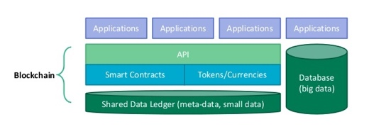

<h1>SecondSpace 第二空间项目白皮书</h1>

 https://secondspace.io 

<b>版权声明：</b>

> &#8195;&#8195;此文档著作权归 Second Space Foundation 所有，严禁抄袭，如需转载，请注明出处。
Second Space Foundation 保留所有通过法律手段保护本文档知识产权的权利。

<!-- TOC -->

- [1 背景](#1-背景)
    - [1.1 项目起源](#11-项目起源)
    - [1.2 市场分析](#12-市场分析)
- [2 平台说明](#2-平台说明)
    - [2.1 目标和使命](#21-目标和使命)
    - [2.2 什么是区块链](#22-什么是区块链)
    - [2.3 为何要用区块链技术](#23-为何要用区块链技术)
- [3 代币发行计划](#3-代币发行计划)
    - [3.1 代币分配方案](#31-代币分配方案)
        - [分配方案：](#分配方案)
    - [3.2 代币发行计划：](#32-代币发行计划)
        - [代币的发行：](#代币的发行)
    - [3.3 挖矿机制](#33-挖矿机制)
    - [3.4 公开募集计划](#34-公开募集计划)
    - [3.5 币值维护计划](#35-币值维护计划)
- [4 技术方案](#4-技术方案)
    - [4.1 技术架构](#41-技术架构)
    - [4.2 业务流程](#42-业务流程)
    - [4.3 收益分配](#43-收益分配)
    - [4.4 开发计划](#44-开发计划)
        - [共识阶段](#共识阶段)
        - [建设阶段](#建设阶段)
        - [发展阶段](#发展阶段)
- [5 团队介绍](#5-团队介绍)
    - [5.1 核心团队](#51-核心团队)
    - [5.2 联合创始人](#52-联合创始人)
    - [5.3 投资人](#53-投资人)
- [6 免责与风险声明](#6-免责与风险声明)
- [引用](#引用)

<!-- /TOC -->

## 1 背景

### 1.1 项目起源

&#8195;&#8195;自以太坊重新定义了智能合约以后，围绕着以太坊的生态环境逐渐建立起来。以太坊用 ERC20 标准让代币的发行和流通变得异常简单，让市场中充斥着各种代币，但用户手握大量的各种加密货币只能有两种应用通路，一是在交易所买卖，二是在 DApp 中使用。这就是现在每隔几个月会出现一款爆红的 DApp，以及交易所持续暴利等现象后的本质原因。因为用户手里的这些热币无处可去，每当看到一个出口时都会像洪水一下奔涌过去。

&#8195;&#8195;在金融历史中，每种货币的发行都有严格的本位机制支撑，每一分货币的发行都是建立在生产创造之上的。假设我们回到远古时代第一枚货币的创造上来看，原始人生产了足够的粮食，满足了自己生存需要后，拿盈余的粮食去与其他人换取一些生活必需品，这时产生了第一枚货币。可见货币的发行是建立在生产的基础之上的。随着历史的发展、金融行业的进步，人们发明了杠杆机制、准备金制度、有了银本位、金本位、信用本位制等货币发行机制，允许我们适当的挣脱生产资料的加锁更灵活的发行货币、增加更多的市场流动性。但无论如何发展，稳定的货币背后总会有一种信用机制保障货币的价值，控制发行的增速在可控的范围内。历史中透支信用、打破货币发行机制的案例也有很多，最终大都以破灭而告终。

&#8195;&#8195;区块链发行的代币大都是凭空发行，虽然用PoW机制锚定了矿机的算力，但这样的算力锚定是否能代替本位制，是需要时间检验的？大部分区块链代币发行，都使用定时的自动增发机制，不考虑市场需求、不考虑流动性的压力，这样的发行机制是否合理？所以加密货币要长远稳定的发展必须找到它独有的更有力支撑机制，以及可控的、合理的货币发行流通机制。

&#8195;&#8195;SecondSpace 第二空间是一个安全、易用、易于扩展的 DApp 开放应用平台，SecondSpace 提供支持各种加密货币的游戏类 DApp 应用，任何人都可以轻松创建和部署自己的DApp。SecondSpace 的使命是为了解决各种加密货币流通性和支撑本位问题而创建的区块链项目。

&#8195;&#8195;SecondSpace 平台提供所有技术架构、解决方案、基础设施、硬件设备、网络带宽。任何人都可以在 SecondSpace 平台上部署并拥有自己的 DApp产品。

> 以太坊用 ERC20 标准让每个人都可以拥有自己的代币，SecondSpace 通过 BlockChain Package 技术让每个人都可以拥有自己的 DApp。 -- Stephen

### 1.2 市场分析

<i>2017年加密货币和美元市场规模的对比（引用1）</i>

&#8195;&#8195;到目前为止全球的加密数字货币总市值约为 2742 亿美元（引用2），一款叫做Crypto Kitties（迷恋猫）的DApp上线半年交易额突破 100 万个 ETH。2018年中一款叫 Fomo3D 的 DApp 游戏上线一个月总投注 96020 个 ETH。这说明什么？全球投入加密货币中的钱太多了，但让用户可配置的资产的项目却很少，用户手里攥着大量的热币无处可去，而每当看到一个可能的出口，都会像洪水一下奔涌过去。所以市场需要更多更优质的 DApp，用于满足大量加密货币的投资和保值的需求。

<i>2016年技术成熟度曲线图(Hype Cycle)</i>

 

<i>2017年技术成熟度曲线图(Hype Cycle)</i>

&#8195;&#8195;Gartner 的 Hype Cycle 技术成熟度曲线图是用来发现和预测新兴技术发展的工具。可以让我们清晰的看到某个技术的未来，研判行业的趋势。我们来对比 2016 年至 2017 年的 Hype Cycle 图表，我们发现区块链技术正在步入成熟期，这说明区块链的基础设施建设基本完毕。将要进入爬坡期，需要整理行囊再次出发，需要找到新的技术突破点，然后进入稳定期。

&#8195;&#8195;Hype Cycle 将新兴技术产业分为五个阶段，Technology Trigger and Peak of Inflated Expectations（上升期和快速发展期）、Trough of Disillusionment（下降期），Slope of Enlightenment（爬坡期），Plateau of Productivity（稳定应用期）。现在的区块链行业已经完成了上升期和快速发展期，后面将会进入爬坡期，需要应用层的技术创新开始发力。

&#8195;&#8195;之前的盈利模式如：ICO，交易所等都会随着上升期和发展期的结束而改变。交易市场只是区块链行业中的基础设施，未来会逐渐下沉，随着基础设施的技术门槛降低、竞争加剧，经过几次洗牌后暴利空间将会回落到正常水平，从而让交易所不在是市场的主角。交易所应用场景单一和经济模型简单，无法满足未来高流通性的需求。就像电信移动一样，他们从来都不是互联网的核心产品。全球现在有 2000 多款加密货币，ICO 已经供大于求，大量 ICO 的代币无人问津。公链真正建立完善社区和产品生态的也只有比特币和以太坊，以太坊已经是全球智能合约的标准，其他的公链产品很难超越它们。

&#8195;&#8195;所以，未来的是DApp的市场，现在 DApp 开发商和参与者还主要是币圈和链圈的人，这个市场需要更多的人参与进来，需要一个人人能参与、人人能发行、简单、好用的 DApp 开放平台。

 
> 链上的问题，只能用在链上解决。 -- Stephen

## 2 平台说明

### 2.1 目标和使命

-	激活更多的加密数字货币，让每个加密货币找到自己的价值
-	帮助更多想参与到区块链盛宴中的人提供便利的通道
-	让持币的用户拥有更多的配置资产的方式和机会

&#8195;&#8195;我们的目标是建立一个支持全币种的 DApp 的开放平台，也就是说不管是比特币、以太坊这种主流币，还是其它空气币都可以在 SecondSpace 平台上使用，将极大的激活加密货币市场。

&#8195;&#8195;我们有开放、公平的机制，让每个参与的人都能找到自己价值，我们努力建立一个多赢的平台。

&#8195;&#8195;拥有各种加密货币的用户可以通过参与 DApp 游戏、应用，有机会让自己的加密货币升值，创造更多的机会。

### 2.2 什么是区块链

&#8195;&#8195;区块链是一种以密码学技术为基础，以去中心化的方式，对大量数据进行组织和维护的数据结构。区块链上的数据全部都附有相关人的数字签名，不可伪造。 此外，区块链还具有完全公开、高可靠性、即时交割、去信任等诸多优点，可以实现全球数据共享和溯源，使得构建更高规模、更高质量、可控制权限、可审计的全球去中心化数据平台的最佳选择。

<i>区块链的生态</i>

### 2.3 为何要用区块链技术

&#8195;&#8195;竞猜游戏的历史可能和货币的历史一样的长，所以竞猜是人类核心欲望的一种体现。但在过去几千年里围绕着竞猜有两个无解的问题，这两个问题一次次伤害这参与游戏的人。

&#8195;&#8195;第一个是游戏的公平性，无法保证所有人在一个公平公正的环境里参与游戏，没有人能提前获知结果，或者影响结果。

&#8195;&#8195;第二个是赔付保证，无法保证赢的人能收到奖励，输的人拿出赔付的财产。

&#8195;&#8195;而区块链的智能合约完美的解决了这两个问题。智能合约不可篡改性、真实性、公平性让竞猜游戏中的核心问题不再是问题。

&#8195;&#8195;另外加密货币还有两个优势，流通性强、交易隐蔽性高。传统货币无法大量全球转移，而且很难隐蔽转移的记录。但区块链技术的匿名性和全球化很好的解决了这些问题。

## 3 代币发行计划

### 3.1 代币分配方案

&#8195;&#8195;代币发行的规模为 100 亿 SSC，主要是参考2017年美国游戏市场的总规模、和加密货币市场在世界经济规模的占比，以及对未来3-5年游戏和加密货币市场的发展，综合评估后的结果（引用6）。

&#8195;&#8195;代币名称：Second Space Coin

&#8195;&#8195;代币缩写：SSC

&#8195;&#8195;发行规模: 100亿

#### 分配方案：

-	创始团队 10%
-	基金会   15%
-	公开募集投资人 10%
-	市场推广激励  5%
-	市场流通  60%

### 3.2 代币发行计划：

代币发行由三个阶段组成：

-	第一阶段：公开募集阶段，币值由基金会制定，随着公开募集计划（详见后面章节）的执行和工作进展，将不断升值。
-	第二阶段：代币应用阶段，平台开发完成，代币开始在平台上使用，允许与比特币、以太坊等数字货币自由兑换。这时的币值绑定美元，每一季度跟踪对标数字货币上季度的平均币值，定制下一季度的 SSC 的价格。
-	第三阶段：登录交易所，在二级市场自由流通，币值将按市场流通情况自由定价。但基金会将定制和实施准备金币值维护计划（详见后面章节），用于防止币值的剧烈波动。

#### 代币的发行：

&#8195;&#8195;『创始团队』和『基金会』持有总币值的 25%，会锁定36个月，每月按平均分配的比例分批释放。

&#8195;&#8195;代币对公众发行主要是『公开募集部分』和『市场流通』部分。共计总币值的 70%。 

&#8195;&#8195;公开募集部分计划发行 10% 的代币，按照公开募集计划（详见下面章节）执行，公开募集计划到期后停止公开募集发行。

&#8195;&#8195;公开募集未完成的份额，将并入市场流通部分。 

&#8195;&#8195;市场流通代币主要由应用平台开发完成后，用户参与和使用平台 DApp 时自由兑换而形成发行。

### 3.3 挖矿机制

流通盘持有即挖矿（PoS），平台的收入主要来自于三个方面。

-	第一：DApp 的销售。
-	第二：DApp 使用过程中产生 1% 的手续费。
-	第三：平台的广告费。

&#8195;&#8195;这些收入会每周根据流通盘（公开募集阶段发行的和市场流通部分发行的）持币者的比例，平均以分红的方式发放给每个人。分配机制详见下图：

<i>持有即挖矿PoS原理</i>

### 3.4 公开募集计划

&#8195;&#8195;代币公开募集时间为 9 个月。从 2018 年 9 月开始至 2019 年 6 月结束。 代币发售按发售数量进行阶梯涨价，最初的募集最优惠，随后的按阶梯涨价，最后阶段将接近 ETH 和现有美元的汇率。

&#8195;&#8195;具体阶段如下，每阶段 1 亿个 SSC。第一阶段的汇率是 1ETH = 3200SSC，第二阶段上涨为 1ETH = 2900SSC，最终第十阶段为 1ETH = 500SSC，接近上一季度 ETH 对美元的加权平均值。 

&#8195;&#8195;从第二阶段每一轮募集比上一轮募集多出来的金额作为分红资金，遵循持有即挖矿的机制，多出来的部分分红，将由上一阶段代币持有者的比例，平均分配发放。每轮募集完成时分配分红一次。分红机制详见下图：

<i>公开募集阶段PoS计划</i>

### 3.5 币值维护计划

&#8195;&#8195;币值维护的三个核心要素：应用需求、备付金制度、信用机制。建立健全的这三个核心要素和机制才能更好的维护币值，让平台和代币健康持续的发展。

-   货币的应用需求是价值的核心体现。整个平台的游戏数量和用户数量将是币值最有力的支撑。
-	准备金制度维护币值，每周披露准备金账号和流通市值的比例，控制准备金在 30%以上。美元和人民币这么强势的货币准备金都在15%-20%之间，所以我们的准备金必须在30%以上。
-	信用披露机制，基于社区的治理机制。透明公开的信息披露是最好的信用背书，平台从智能合约到代币募集、以及平台上线都将实施开源开放政策，所有的数据和代码都是开放给社区，由社区监督维护。
-	严格控制流动性，定期根据近期的市场流动性报告，科学合理的释放发行比例。我们的发行机制不再是笨拙的、自动的、不与市场沟通的发行机制，而是根据市场反应，根据市场需求实施相应的宽松或紧缩的发行政策。

> Second Sapce 可能是东半球最好的区块链项目了。 -- Stephen

## 4 技术方案

### 4.1 技术架构

<i>SecondSpace 平台技术架构</i>

&#8195;&#8195;SecondSpace 平台基于以太坊网络智能合约技术和Node技术混合开发而成，项目架构分为三层。

- 最底层基于以太坊的智能合约平台，实现核心算法和逻辑，提供通用的基础模块，基础加密算法，网络通信库，数据流处理库，信息封装与解码，系统时间等基础设施。智能合约基于先进的 Truffle 开发框架和 Openzeppelin Solidity 开发库编写而成，提供了核心的基础稳定性和安全性。底层合约集成了 Ownable，Whitelist，AccessControl，VestingStage 等多重控制模块，让 SSC 币拥有了高安全性，高稳定性，高扩展性的属性。而且 SecondSpace 开创性的用智能合约管理代币的市场流动性，为其他代币的发行和管理做出了优秀的表率。SecondSpace 智能合约的代码都是开源开放透明的，任何人任何机构都可以审查 SecondSpace 的核心底层代码，帮助 SecondSpace 平台和社区更稳定的发展。

- 中间层是核心数据交换模块，包含区块链平台的核心逻辑，P2P网络协议，共识模块，交易处理模块，JSON/RPC数据交换接口，钱包模块等。中间层使用 Docker 微服务架构体系，提供客户端发现模式，以及服务端发现两种模式。客户端从一个服务注册服务中心查询所有可用服务实例。客户端使用负载均衡算法从多个可用的服务实例中选择出一个，然后发出请求。服务端发现向负载均衡器发出请求，负载均衡器向服务注册表发出请求，将请求转发到注册表中可用的服务实例。通过实现集群化的微服务架构，可以让中间层拥有更高的负载能力，为整个平台提供稳定优质的基础服务。

<i>微服务和服务发现</i>

- 最上面一层，用户UI交互层，主要由NodeJs，VUE，UI界面，WebSocket组成。Vue 全球最优秀的前端框架之一，是一套用于构建用户界面的渐进式框架。与其它大型框架不同的是，Vue 被设计为可以自底向上逐层应用。Vue 的核心库只关注视图层，便于与第三方库或既有项目整合。另一方面，当与现代化的工具链以及各种支持类库结合使用时，Vue 也完全能够为复杂的单页应用提供驱动。

- 为了让我们的 DApp 开发效率更高，扩展性更好，我们发布了 BlockChainPacakge 1.0 技术标准（简称BCP），通过BCP技术可以让 DApp 的开发容易，部署更简单，同时可以支持 DApp 跨链部署、移动部署等高级特性，成为区块链领域中的标准技术，任何支持 BCP 协议的公链都以无缝的对接大量现成的 DApp，为各种代币公链提供充足的应用场景。购买 DApp 的用户可以像安装软件一样，将自己的 DApp 安装在任意的服务器上。方便简洁的调整 BCP 中的参数为 DApp 的运营提供强大的支持。

### 4.2 业务流程

<i>解决方案和业务流程</i>

### 4.3 收益分配

- 第一：DApp 的销售。自由定价
- 第二：DApp 使用过程中产生的手续费，平台收取双向手续费 1%。
- 第三：平台的广告费。

### 4.4 开发计划

#### 共识阶段
- 2018年8月 Second Space 立项 
- 2018年9月 发布官网及白皮书（https://secondspace.io）
- 2018年10月 首次公开发行 ICO

#### 建设阶段

- 2018年10月 Second Space 开始接入游戏
- 2018年12月 Second Space 1.0 平台内测 
- 2019年1月  Second Space 1.0 正式上线

#### 发展阶段
- 2019年4月 Second Space 2.0 正式上线
- 2019年5月 SSC 正式登录交易所

## 5 团队介绍

### 5.1 核心团队

### 5.2 联合创始人

### 5.3 投资人

## 6 免责与风险声明
&#8195;&#8195;本白皮书仅限于用户对 SecondSpace 项目及 SSC 币兑换的说明，为基金会及平台发起人共同制定，并不构成对平台及 SSC 的专业意见；本白皮书中的内容不构成任何承诺及保证；亦不作为对白皮书所描述事项任何合法及合规性承诺，本白皮书不作为对 SSC 进行兑换的协议组成；本白皮书中的信息或分析不构成任何决策或建议，请阅读者自行对行业及本白皮书中描述的商业模式的可行性、合理性及合法性自行决策，本白皮书不组成也不理解为提供任何兑换行为，或任何与兑换相关的邀约邀请，也不构成任何形式上的合约或者承诺。意向兑换人若自行决策后进行兑换，应当完全接受该等风险，并愿意自行为此承担一切相应结果或后果。基金会及平台发起人明确表示不承担任何参与项目造成的直接或间接的损失，包括但不限于:

- 因为用户交易操作带来的经济损失
- 由个人理解产生的任何错误、疏忽或者不准确信息
- 个人交易各类区块链资产带来的损失及由此导致的任何行为

&#8195;&#8195;SecondSpace 是一个平台平台使用的加密 Token。兑换 SSC 不是一种投资，我们无法保证 SSC 一定会增值，在某种情况下具有价值下降的可能，没有正确使用 SSC 的用户有可能失去使用 SSC 的权利，甚至可能失去他们的 SSC。基金会及平台发起人现向意向用户明确说明兑换 SSC 的风险，意向用户一旦参与即应当被认为明确知悉并完全了解以下风险：

- 技术安全性风险
  
&#8195;&#8195;许多数字资产平台因为安全性问题而停止运营。我们非常重视安全，但世界上不存在绝对意义上的 100% 安全，例如:由于不可抗力导致的各种损失。我们承诺尽一切可能确保平台的技术安全性。

- 法律政策风险
  
&#8195;&#8195;由于加密货币及 Token 的发行具有极大的创新性，在全球范围内的绝大多数国家均具有法律空白，行业存在极大的法律及政策不确定性，因此平台存在被认定为违法的可能性。

- 价格波动风险

&#8195;&#8195;若在公开市场上交易，加密通证通常价格波动剧烈。短期内价格震荡经常发生。该价格可能以比特币、以太币、美元或其他法币计价。这种价格波动可能由于市场力量（包括投机买卖）、监管政策变化、技术革新、平台的可获得性以及其他客观因素造成，这种波动也反映了供需平衡的变化。无论是否存在 SSC 交易的二级市场，SecondSpace 项目的开发和运营团队对任何二级市场的 SSC 交易不承担责任。我们相信 SecondSpace 项目团队有能力也有义务稳定 SSC 的价格波动。但 SSC 交易价格所涉风险需由 SSC 交易者自行承担。

## 引用

2.	https://www.businessinsider.com/bitcoin-compared-to-all-of-the-worlds-money-2017-6
1.	https://coinmarketcap.com/charts/
3.	https://en.wikipedia.org/wiki/Hype_cycle
4.	http://dappboard.com/app
5.	http://exitscam.me/play
6.	https://world-lotteries.org/media-news/publications/wla-compendia/2698-the-wla-global-lottery-data-compendium-2017
